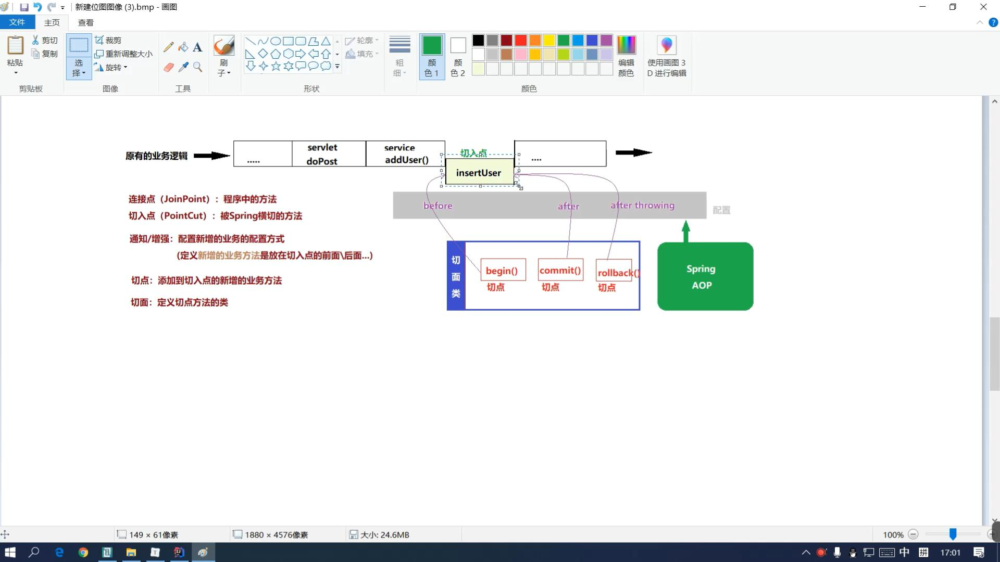

* 初始化方法在构造器执行之后执行
* 销毁方法在对象销毁之前调用

## @Autowired ,@Qualifier,@Resource区别
* @Autowired:按照类型进行自动装配
* @Qualifier:对于@Autowired按照类型进行装配在容器中找到多个可装配类型Bean时,指定BeanName就行装配,经常和@Autowired搭配使用
* @Resource:默认装配方式为ByName,如果没有找到对应BeanName,则在容器中找可以注入的类型装配,如果还找不到,报错

## 动态代理
* jdk动态代理:通过被代理类实现的接口创建代理对象,需要被代理类实现接口
* cglib动态代理:通过创建被代理类的子类来创建代理对象,被代理类无需实现接口 不能对final修饰的类产生代理对象

## aop:面向切面编程

* 连接点(JoinPoint):所有类的方法
* 切入点(PointCut):真正被增强的方法
* 通知(也有称之为增强):放在切入点前面或者后面的执行逻辑
* 切点: 实现增强功能的方法逻辑
* 切面: 定义切点方法的类 
* 增强: 在切入点织入切点

注意:
* 如果要使用spring aop面向切面编程,调用切入点方法的对象必须通过spring容器获取
* 如果一个类的方法被声明为切入点并且织入了切点之后,通过spring容器获取该类对象,实则是一个代理对象
* 如果一个类中的方法没有声明为切入点,通过spring容器获取的这个类对象就是spring容器通过反射创建的对象

## AOP的通知策略(如何将切点织入切入点)
* before
* after
* afterReturning
* afterThrowing
* around

## 切入点表达式的关键字
  支持的AspectJ切入点指示符如下: 

 * execution:用于匹配方法执行的连接点； 
 * within:用于匹配指定类型内的方法执行； 
 * this:用于匹配当前AOP代理对象类型的执行方法；注意是AOP代理对象的类型匹配,这样就可能包括引入接口也类型匹配； 
 * target:用于匹配当前目标对象类型的执行方法；注意是目标对象的类型匹配,这样就 不包括引入接口也类型匹配； 
 * args:用于匹配当前执行的方法传入的参数为指定类型的执行方法； @within:用于匹配所以持有指定注解类型内的方法； 
 * @target:用于匹配当前目标对象类型的执行方法,其中目标对象持有指定的注解； 
 * @args:用于匹配当前执行的方法传入的参数持有指定注解的执行； 
 * @annotation:用于匹配当前执行方法持有指定注解的方法； 
 * bean:Spring AOP扩展的,AspectJ没有对于指示符,用于匹配特定名称的Bean对象的 执行方法； 
 * reference pointcut:表示引用其他命名切入点,只有@ApectJ风格支持,Schema风 格不支持。
 
 ## 切入点表达式的通配符
 AspectJ类型匹配的通配符:
 
      *:匹配任何数量字符； 
      ..:匹配任何数量字符的重复,如在类型模式中匹配任何数量子包；而在方法参数模式 中匹配任何数量参数。 
      +:匹配指定类型的子类型；仅能作为后缀放在类型模式后边。 说明: java.lang.String 匹配String类型； 
      java.*.String 匹配java包下的任何“一级子包”下的String类型； 如匹配java.lang.String,但不匹配java.lang.ss.String 
      java..* 匹配java包及任何子包下的任何类型; 如匹配java.lang.String、java.lang.annotation.Annotation 
      java.lang.*ing 匹配任何java.lang包下的以ing结尾的类型； 
      java.lang.Number+ 匹配java.lang包下的任何Number的自类型； 如匹配java.lang.Integer,也匹配java.math.BigInteger 
      
## 标准的AspectJ Aop的pointcut的表达式类型是很丰富的,但是Spring Aop只支持其中的9种,外加Spring Aop自己扩充的一种一共是11(10+1)种类型的表达式,分别如下。

* execution:一般用于指定方法的执行,用的最多。
* within:指定某些类型的全部方法执行,也可用来指定一个包。
* this:Spring Aop是基于动态代理的,生成的bean也是一个代理对象,this就是这个代理对象,当这个对象可以转换为指定的类型时,对应的切入点就是它了,Spring Aop将生效。
* target:当被代理的对象可以转换为指定的类型时,对应的切入点就是它了,Spring Aop将生效。
* args:当执行的方法的参数是指定类型时生效。
* @target:当代理的目标对象上拥有指定的注解时生效。
* @args:当执行的方法参数类型上拥有指定的注解时生效。
* @within:与@target类似,看官方文档和网上的说法都是@within只需要目标对象的类或者父类上有指定的注解,则@within会生效,而@target则是必须是目标对象的类上有指定的注解。而根据笔者的测试这两者都是只要目标类或父类上有指定的注解即可。
* @annotation:当执行的方法上拥有指定的注解时生效。
* reference pointcut:(经常使用)表示引用其他命名切入点,只有@ApectJ风格支持,Schema风格不支持
* bean:当调用的方法是指定的bean的方法时生效。(Spring AOP自己扩展支持的)

Pointcut定义时,还可以使用&&、||、! 这三个运算。进行逻辑运算。可以把各种条件组合起来使用

### execution是使用的最多的一种Pointcut表达式,表示某个方法的执行,其标准语法如下。

execution(modifiers-pattern? ret-type-pattern declaring-type-pattern? name-pattern(param-pattern) throws-pattern?)

* 修饰符匹配（modifier-pattern?）
* 返回值匹配（ret-type-pattern）可以为*表示任何返回值,全路径的类名等
* 类路径匹配（declaring-type-pattern?）
* 方法名匹配（name-pattern）可以指定方法名 或者 代表所有, set 代表以set开头的所有方法
* 参数匹配（(param-pattern)）可以指定具体的参数类型,多个参数间用“,”隔开,各个参数也可以用“”来表示匹配任意类型的参数,如(String)表示匹配一个String参数的方法；(,String) 表示匹配有两个参数的方法,第一个参数可以是任意类型,而第二个参数是String类型；可以用(…)表示零个或多个任意参数
* 异常类型匹配（throws-pattern?）
* 其中后面跟着“?”的是可选项

## pointCut 示例
### 基础示例
 表示匹配所有方法  
 1）execution(* *(..))  
 
 表示匹配com.learn.UserService中所有的公有方法  
 2）execution(public * com.learn.UserService.*(..))  
 
 表示匹配com.learn包及其子包下的所有方法
 3）execution(* com.learn..*.*(..))  

### Pointcut定义时,还可以使用&&、||、! 这三个运算。进行逻辑运算
 
签名:消息发送切面

    @Pointcut("execution(* com.learn.MessageSender.*(..))")
    private void logSender(){
    }

签名:消息接收切面

    @Pointcut("execution(* com.learn.MessageReceiver.*(..))")
    private void logReceiver(){
    }

只要满足发送  或者  接收  这个切面都会切进去

    @Pointcut("logSender() || logReceiver()")
    private void logMessage(){
    }
 这个例子中,logMessage()将匹配任何MessageSender和MessageReceiver中的任何方法。

## within:
   within是用来指定类型的,指定类型中的所有方法将被拦截。
   
    // AService下面所有外部调用方法,都会拦截。备注:只能是AService的方法,子类不会拦截的
     @Pointcut("within(com.learn.service.AService)")
     public void pointCut() {
     }
    
   所以此处需要注意:上面写的是AService接口,是达不到拦截效果的,只能写实现类:
   
     //此处只能写实现类
     @Pointcut("within(com.learn.service.impl.AServiceImpl)")
     public void pointCut() {
     }
     
   匹配包以及子包内的所有类:
    
    @Pointcut("within(com.learn.service..*)")
     public void pointCut() {
     }
 
 ## this:
   Spring Aop是基于代理的,this就表示代理对象。
   this类型的Pointcut表达式的语法是this(type),当生成的代理对象可以转换为type指定的类型时则表示匹配。
   基于JDK接口的代理和基于CGLIB的代理生成的代理对象是不一样的。（注意和上面within的区别）
   
        // 这样子,就可以拦截到AService所有的子类的所有外部调用方法
        @Pointcut("this(com.learn.service.AService)")
        public void pointCut() {
        }
        
## target:
Spring Aop是基于代理的,target则表示被代理的目标对象。
当被代理的目标对象可以被转换为指定的类型时则表示匹配。 
注意:和上面不一样,这里是target,因此如果要切入,只能写实现类了

     @Pointcut("target(com.learn.service.impl.AServiceImpl)")
         public void pointCut() {
     }
     
## args:
args用来匹配方法参数的。
这个匹配的范围非常广,所以一般和别的表达式结合起来使用

* “args()”匹配任何不带参数的方法。
* “args(java.lang.String)” 匹配任何只带一个参数,而且这个参数的类型是String的方法。
* “args(…)”带任意参数的方法。
* “args(java.lang.String,…)” 匹配带任意个参数,但是第一个参数的类型是String的方法。
* “args(…,java.lang.String)” 匹配带任意个参数,但是最后一个参数的类型是String的方法。

     @Pointcut("args()")
      public void pointCut() {
     }
     
## @target:
@target匹配当被代理的目标对象对应的类型及其父类型上拥有指定的注解时。

  //能够切入类上（非方法上）标准了MyAnno注解的所有外部调用方法
  
     @Pointcut("@target(com.learn.anno.MyAnno)")
     public void pointCut() {
     }

## @args:
@args匹配被调用的方法上含有参数,且对应的参数类型上拥有指定的注解的情况。

如BServiceImpl.anno(Book book ) Book类使用@MyAnno修饰
 
    @Pointcut("@args(com.learn.anno.MyAnno)")
    public void pointCut7() {

    }

## @within:
@within用于匹配被代理的目标对象对应的类型或其父类型拥有指定的注解的情况,但只有在调用拥有指定注解的类上的方法时才匹配。
    
   “@within(com.learn.anno.MyAnno)”匹配被调用的方法声明的类上拥有MyAnno注解的情况。
   比如有一个ClassA上使用了注解MyAnno标注,并且定义了一个方法a(),那么在调用ClassA.a()方法时将匹配该Pointcut；
   如果有一个ClassB上没有MyAnno注解,但是它继承自ClassA,同时它上面定义了一个方法b(),
   那么在调用ClassB().b()方法时不会匹配该Pointcut,但是在调用ClassB().a()时将匹配该方法调用,因为a()是定义在父类型ClassA上的,
   且ClassA上使用了MyAnno注解。但是如果子类ClassB覆写了父类ClassA的a()方法,则调用ClassB.a()方法时也不匹配该Pointcut。

## @annotation
 可以匹配所有方法上标有此注解的方法
 
     @Pointcut("@annotation(com.learn.anno.MyAnno)")
     public void pointCut() {
     }
     
## bean: 这是Spring增加的一种方法，spring独有
bean用于匹配当调用的是指定的Spring的某个bean的方法时。
* “bean(abc)”匹配Spring Bean容器中id或name为abc的bean的方法调用。
* “bean(user*)”匹配所有id或name为以user开头的bean的方法调用。

     
    @Pointcut("bean(AServiceImpl)")
    public void pointCut() {
    }
    
## 表达式的组合
表达式的组合其实就是对应的表达式的逻辑运算，与、或、非。可以通过它们把多个表达式组合在一起。
* “bean(userService) && args()”匹配id或name为userService的bean的所有无参方法。
* “bean(userService) || @annotation(MyAnnotation)”匹配id或name为userService的bean的方法调用，或者是方法上使用了MyAnnotation注解的方法调用。 
* “bean(userService) && !args()”匹配id或name为userService的bean的所有有参方法调用。

## tx:method 的属性详解:

### readOnly:
事务属性中的readOnly标志表示对应的事务应该被最优化为只读事务。如果值为true就会告诉Spring我这个方法里面没有insert或者update，你只需要提供只读的数据库Connection就行了，这种执行效率会比read-write的Connection高，所以这是一个最优化提示。在一些情况下，一些事务策略能够起到显著的最优化效果，例如在使用Object/Relational映射工具（如:Hibernate或TopLink）时避免dirty checking（试图“刷新”）。

### timeout:
在属性中还有定义“timeout”值的选项，指定事务超时为几秒。一般不会使用这个属性。在JTA中，这将被简单地传递到J2EE服务器的事务协调程序，并据此得到相应的解释。

### Isolation Level(事务隔离等级)的5个枚举值
为什么事务要有Isolation Level这个属性？先回顾下数据库事务的知识:
* 第一类丢失更新(lost update):在完全未隔离事务的情况下，两个事物更新同一条数据资源，某一事物异常终止，回滚造成第一个完成的更新也同时丢失。
* 第二类丢失更新(second lost updates):是不可重复读的特殊情况，如果两个事务都读取同一行，然后两个都进行写操作，并提交，第一个事务所做的改变就会丢失。
* 脏读(dirty read):如果第二个事务查询到第一个事务还未提交的更新数据，形成脏读。因为第一个事务你还不知道是否提交，所以数据不一定是正确的。
* 虚读(phantom read):一个事务执行两次查询，第二次结果集包含第一次中没有或者某些行已被删除，造成两次结果不一致，只是另一个事务在这两次查询中间插入或者删除了数据造成的。
* 不可重复读(unrepeated read):一个事务两次读取同一行数据，结果得到不同状态结果，如中间正好另一个事务更新了该数据，两次结果相异，不可信任。

### 当遇到以上这些情况时我们可以设置isolation下面这些枚举值:
* DEFAULT:采用数据库默认隔离级别
* SERIALIZABLE:最严格的级别，事务串行执行，资源消耗最大；
* REPEATABLE_READ:保证了一个事务不会修改已经由另一个事务读取但未提交（回滚）的数据。避免了“脏读取”和“不可重复读取”的情况，但是带来了更多的性能损失。
* READ_COMMITTED:大多数主流数据库的默认事务等级，保证了一个事务不会读到另一个并行事务已修改但未提交的数据，避免了“脏读取”。该级别适用于大多数系统。
* READ_UNCOMMITTED:保证了读取过程中不会读取到非法数据。隔离级别在于处理多事务的并发问题。

### 关于propagation属性的7个传播行为
* REQUIRED:指定当前方法必需在事务环境中运行，如果当前有事务环境就加入当前正在执行的事务环境，如果当前没有事务，就新建一个事务。这是默认值。
* SUPPORTS:指定当前方法加入当前事务环境，如果当前没有事务，就以非事务方式执行。
* MANDATORY:指定当前方法必须加入当前事务环境，如果当前没有事务，就抛出异常。
* REQUIRES_NEW:指定当前方法总是会为自己发起一个新的事务，如果发现当前方法已运行在一个事务中,则原有事务被挂起,我自己创建一个属于自己的事务,直我自己这个方法commit结束,原先的事务才会恢复执行。
* NOT_SUPPORTED:指定当前方法以非事务方式执行操作，如果当前存在事务，就把当前事务挂起，等我以非事务的状态运行完，再继续原来的事务。
* NEVER:指定当前方法绝对不能在事务范围内执行，如果方法在某个事务范围内执行，容器就抛异常，只有没关联到事务，才正常执行。
* NESTED:指定当前方法执行时，如果已经有一个事务存在,则运行在这个嵌套的事务中.如果当前环境没有运行的事务，就新建一个事务，并与父事务相互独立，这个事务拥有多个可以回滚的保证点。就是指我自己内部事务回滚不会对外部事务造成影响，只对DataSourceTransactionManager事务管理器起效。